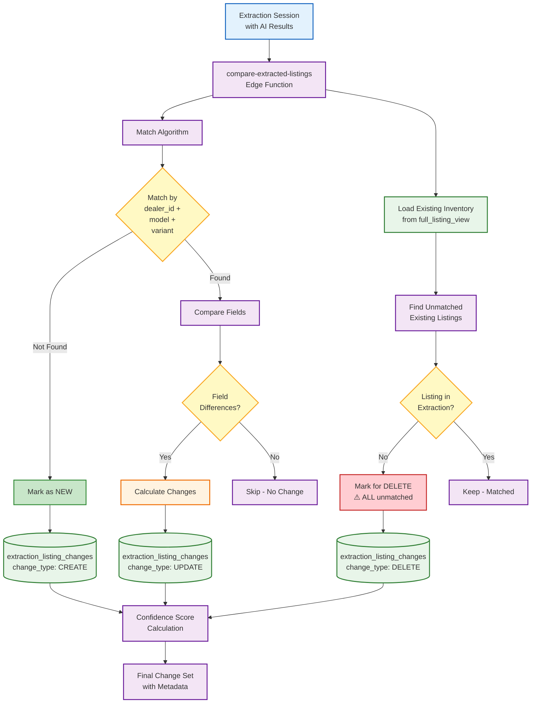
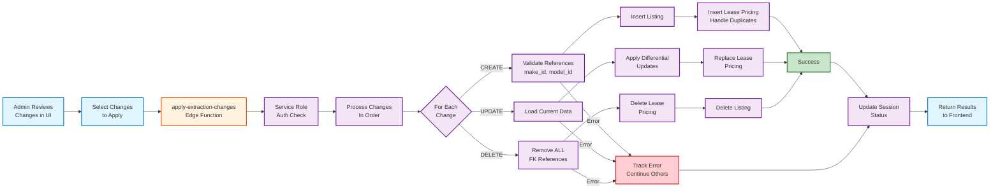

# AI Extraction - Comparison and Change Application Deep Dive

## Overview
This document provides an in-depth look at the comparison engine and change application system, which forms the heart of the AI PDF extraction workflow.

## Comparison Engine Architecture



## Change Detection Logic

### 1. CREATE Detection
```typescript
// Identifies new listings not in current inventory
interface CreateDetection {
  // Triggered when:
  extracted_model + extracted_variant NOT IN existing_inventory
  
  // Creates record with:
  change_type: 'CREATE'
  extracted_data: {
    make, model, variant, // Core identifiers
    retail_price,         // Base pricing
    monthly_price,        // Display price
    offers: [{            // All lease options
      monthly_price,
      period_months,
      mileage_per_year,
      first_payment
    }]
  }
  confidence_score: 0.0-1.0  // AI confidence
  validation_errors: []      // Any issues found
}
```

### 2. UPDATE Detection
```typescript
// Identifies changes in existing listings
interface UpdateDetection {
  // Triggered when:
  model + variant MATCH but fields DIFFER
  
  // Tracks changes:
  changes: {
    monthly_price?: { old: 4500, new: 4999 },
    retail_price?: { old: 45000, new: 47000 },
    availability?: { old: 'in_stock', new: 'order' },
    // ... any changed field
  }
  
  // Special handling:
  - Ignores unchanged fields
  - Calculates percentage changes
  - Flags significant changes (>10%)
}
```

### 3. DELETE Detection (Critical Change!)
```typescript
// Marks listings for removal
interface DeleteDetection {
  // OLD Logic (before July 2025):
  if (existing_listing.model IN extracted_models) {
    // Only delete if model was in PDF
    mark_for_deletion()
  }
  
  // NEW Logic (July 2025+):
  if (existing_listing NOT IN extraction_results) {
    // DELETE ALL unmatched, regardless of model!
    mark_for_deletion()
  }
  
  // ⚠️ WARNING: Uploading single model PDF will
  // suggest deleting entire inventory!
}
```

## Change Application Flow



## Database Operations Detail

### CREATE Operation Sequence
```sql
-- 1. Validate references
SELECT id FROM makes WHERE name = 'Volkswagen';
SELECT id FROM models WHERE name = 'ID.4' AND make_id = ?;

-- 2. Insert listing
INSERT INTO listings (
  dealer_id, make_id, model_id, variant,
  retail_price, monthly_price, status
) VALUES (?, ?, ?, ?, ?, ?, 'active')
RETURNING id;

-- 3. Insert lease pricing (with duplicate handling)
INSERT INTO lease_pricing (
  listing_id, monthly_price, period_months,
  mileage_per_year, first_payment
) VALUES (?, ?, ?, ?, ?)
ON CONFLICT (listing_id, mileage_per_year, first_payment, period_months)
DO UPDATE SET monthly_price = EXCLUDED.monthly_price;

-- 4. Update extraction record
UPDATE extraction_listing_changes 
SET status = 'applied', applied_at = NOW()
WHERE id = ?;
```

### UPDATE Operation Sequence
```sql
-- 1. Build dynamic update
UPDATE listings SET
  monthly_price = COALESCE(?, monthly_price),
  retail_price = COALESCE(?, retail_price),
  availability = COALESCE(?, availability),
  updated_at = NOW()
WHERE id = ?;

-- 2. Delete old pricing
DELETE FROM lease_pricing WHERE listing_id = ?;

-- 3. Insert new pricing
INSERT INTO lease_pricing (...) VALUES (...);

-- 4. Log changes
INSERT INTO api_call_logs (
  action, details, cost
) VALUES ('update_listing', ?, 0);
```

### DELETE Operation Sequence (Critical!)
```sql
-- 1. Remove ALL extraction references (NEW!)
DELETE FROM extraction_listing_changes 
WHERE listing_id = ? 
-- Not just current session!

-- 2. Remove lease pricing
DELETE FROM lease_pricing 
WHERE listing_id = ?;

-- 3. Delete listing
DELETE FROM listings 
WHERE id = ?;

-- 4. Update session
UPDATE extraction_listing_changes
SET status = 'applied'
WHERE id = ?;
```

## Error Handling & Recovery

### Per-Change Error Isolation
```typescript
interface ChangeApplicationResult {
  sessionId: string;
  applied: {
    created: number;
    updated: number;
    deleted: number;
  };
  errors: Array<{
    changeId: string;
    changeType: 'CREATE' | 'UPDATE' | 'DELETE';
    error: string;
    details: any;
  }>;
  sessionStatus: 'completed' | 'partially_applied';
}
```

### Common Error Scenarios

1. **Reference Validation Failure**
```
Error: Make 'Vokswagen' not found (typo)
Solution: AI extraction error, needs manual fix
```

2. **Foreign Key Constraint**
```
Error: Cannot delete - pricing records exist
Solution: Enhanced deletion now handles this
```

3. **Duplicate Key Violation**
```
Error: Listing already exists
Solution: ON CONFLICT handling added
```

## Frontend Integration

### Review Interface Components
```typescript
// ExtractionReview.tsx
const ComparisonView = () => {
  // Side-by-side comparison
  return (
    <div className="grid grid-cols-2 gap-4">
      <CurrentDataCard listing={current} />
      <ExtractedDataCard 
        data={extracted}
        changes={changes}
        confidence={confidence}
      />
    </div>
  );
};

// Change selection
const ChangeSelector = () => {
  const [selected, setSelected] = useState([]);
  
  return (
    <Checkbox
      checked={selected.includes(change.id)}
      onCheckedChange={(checked) => {
        if (checked) {
          setSelected([...selected, change.id]);
        }
      }}
    />
  );
};
```

### Apply Changes Hook
```typescript
// useListingComparison.ts
const applySelectedChanges = async ({
  sessionId,
  selectedChangeIds,
  appliedBy
}) => {
  const { data, error } = await supabase.functions.invoke(
    'apply-extraction-changes',
    {
      body: {
        sessionId,
        selectedChangeIds,
        appliedBy
      }
    }
  );
  
  // Handle results
  if (data.errors.length > 0) {
    toast.error(`${data.errors.length} changes failed`);
  }
  
  // Invalidate caches
  queryClient.invalidateQueries(['listings']);
  queryClient.invalidateQueries(['extraction-session', sessionId]);
};
```

## Best Practices & Warnings

### DO:
- ✅ Review ALL deletions before applying
- ✅ Upload complete inventories when possible
- ✅ Monitor error logs for silent failures
- ✅ Test with small batches first
- ✅ Verify column mappings match schema

### DON'T:
- ❌ Upload partial inventories without reviewing deletions
- ❌ Assume all changes applied successfully
- ❌ Skip confidence score validation
- ❌ Ignore duplicate warnings
- ❌ Apply changes without backup

### Critical Reminders:
1. **Deletion Scope**: ALL unmatched listings are marked for deletion
2. **Error Visibility**: Some errors may be silent - check logs
3. **Duplicate Handling**: ON CONFLICT prevents some errors but not all
4. **Performance**: Large batches may timeout - use pagination
5. **Validation**: Always validate references before applying