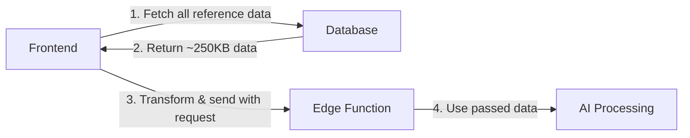
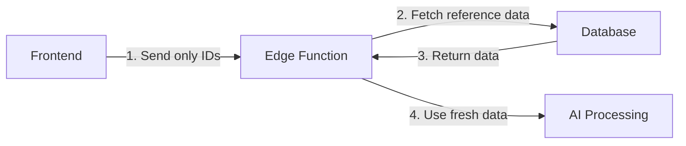

# Reference Data Refactoring Proposal: Edge Function Database Fetching

## Executive Summary

This document proposes refactoring the AI PDF extraction system to fetch vehicle reference data directly from the database within the edge function, rather than passing it from the frontend. This change would reduce network payload by ~250KB per extraction request and ensure reference data is always current.

## Current Architecture

### Data Flow


### Current Implementation Details

#### Frontend (`SellerBulkPDFExtractionModal.tsx`)
- Fetches reference data via `useReferenceData()` hook
- Transforms into simplified format:
  ```javascript
  {
    makes_models: { "BMW": ["X5", "X3", ...], "Audi": [...] },
    fuel_types: ["Electric", "Petrol", ...],
    transmissions: ["Automatic", "Manual"],
    body_types: ["SUV", "Sedan", ...]
  }
  ```
- Sends entire reference dataset with each extraction request
- Cache time: 1 hour (via React Query)

#### Edge Function (`ai-extract-vehicles/index.ts`)
- Receives reference data in request body
- Uses `safeReferenceData.makes_models` for make/model validation
- Falls back to empty structure if not provided
- Recently fixed: Case-insensitive matching + fallback for unknown makes

### Current Payload Size Analysis

```
Per extraction request:
├── PDF text content: ~50-200KB (varies)
├── Reference data: ~250KB (consistent)
│   ├── makes_models: ~200KB (50+ makes × ~20 models each)
│   ├── fuel_types: ~1KB
│   ├── transmissions: ~0.5KB
│   └── body_types: ~1KB
├── Existing listings: ~10-100KB (varies by dealer)
└── Total: 310-550KB per request
```

## Proposed Architecture

### New Data Flow


### Proposed Implementation

#### Edge Function Changes
```typescript
// New function to fetch reference data
async function fetchReferenceData(supabase: SupabaseClient) {
  const [makesResult, modelsResult, bodyTypesResult, fuelTypesResult, transmissionsResult] = 
    await Promise.all([
      supabase.from('makes').select('id, name').order('name'),
      supabase.from('models').select('id, name, make_id').order('name'),
      supabase.from('body_types').select('id, name').order('name'),
      supabase.from('fuel_types').select('id, name').order('name'),
      supabase.from('transmissions').select('id, name').order('name')
    ])

  // Transform to expected format
  const makes_models = makesResult.data?.reduce((acc, make) => {
    acc[make.name] = modelsResult.data
      ?.filter(m => m.make_id === make.id)
      .map(m => m.name) || []
    return acc
  }, {} as Record<string, string[]>) || {}

  return {
    makes_models,
    fuel_types: fuelTypesResult.data?.map(ft => ft.name) || [],
    transmissions: transmissionsResult.data?.map(t => t.name) || [],
    body_types: bodyTypesResult.data?.map(bt => bt.name) || []
  }
}

// In main handler
const referenceData = requestBody.referenceData || 
  await fetchReferenceData(supabase)
```

#### Frontend Simplification
- Remove reference data transformation logic (-50 lines)
- Stop fetching reference data for extraction (-1 hook call)
- Only send: `seller_id`, `make_id`, `make_name`
- Request payload reduced by ~250KB

## Impact Analysis

### Performance Impact

#### Network Performance
| Metric | Current | Proposed | Impact |
|--------|---------|----------|--------|
| Request size | 310-550KB | 60-300KB | **-45-80% reduction** |
| Upload time (10Mbps) | 248-440ms | 48-240ms | **-200ms faster** |
| Mobile data usage | High | Low | **Significant savings** |

#### Database Performance
| Operation | Current | Proposed | Impact |
|-----------|---------|----------|--------|
| Frontend DB queries | 5 tables on load | 0 for extraction | **Reduced** |
| Edge function queries | 0 | 5 tables per extraction | **+5 queries** |
| Query time | N/A | ~20-50ms total | **Minimal** |
| Query complexity | N/A | Simple SELECTs | **Low impact** |

### Reliability Impact

#### Data Freshness
- **Current**: Up to 1 hour stale (React Query cache)
- **Proposed**: Always fresh from database
- **Benefit**: New makes/models immediately available for extraction

#### Error Scenarios
| Scenario | Current Behavior | Proposed Behavior |
|----------|------------------|-------------------|
| Reference data fetch fails | Uses cached or empty data | Can retry or use fallback |
| Network timeout | Large payload may timeout | Smaller payload, less risk |
| Database connection issue | Frontend fails earlier | Edge function handles gracefully |

### Security Considerations

#### Current Approach
- Reference data exposed to client
- Potential for client-side manipulation
- All reference data visible in browser DevTools

#### Proposed Approach
- Reference data stays server-side
- No client manipulation possible
- Reduced attack surface

### Scalability Analysis

#### Growth Projections
```
Assuming 2x growth per year:
- Year 1: 50 makes, 1000 models = ~250KB
- Year 2: 100 makes, 2000 models = ~500KB
- Year 3: 200 makes, 4000 models = ~1MB

Current approach: Payload grows linearly
Proposed approach: Payload stays constant
```

#### Cost Analysis (Supabase/Vercel)
- **Bandwidth savings**: ~250KB × 1000 extractions/month = 250MB/month saved
- **Database queries**: +5000 queries/month (negligible cost)
- **Edge function execution**: Slightly longer (+20-50ms)
- **Net result**: Cost neutral or slight savings

## Migration Strategy

### Phase 1: Backward Compatible (Week 1)
1. Add database fetching to edge function
2. Use passed data if provided, else fetch
3. Deploy and monitor
4. No frontend changes required

### Phase 2: Frontend Cleanup (Week 2)
1. Remove reference data passing from frontend
2. Update all extraction calls
3. Remove unused transformation logic
4. Update tests

### Phase 3: Optimization (Week 3)
1. Add caching layer in edge function (5-minute TTL)
2. Optimize database queries
3. Add monitoring/metrics

## Risk Analysis

### Risks and Mitigations

| Risk | Probability | Impact | Mitigation |
|------|-------------|--------|------------|
| Database connection failure | Low | High | Implement retry logic + circuit breaker |
| Query performance degradation | Low | Medium | Add database indexes, monitor query times |
| Breaking change for other consumers | Medium | High | Maintain backward compatibility in Phase 1 |
| Increased database load | Medium | Low | Implement edge function caching |

## Testing Requirements

### Unit Tests
- [ ] Reference data fetching function
- [ ] Fallback logic when fetch fails
- [ ] Backward compatibility with passed data
- [ ] Make name matching (case-insensitive)

### Integration Tests
- [ ] End-to-end extraction with database fetch
- [ ] Performance under load (concurrent extractions)
- [ ] Network failure scenarios
- [ ] Database timeout handling

### Performance Tests
- [ ] Measure request payload reduction
- [ ] Compare extraction times (before/after)
- [ ] Database query performance
- [ ] Memory usage in edge function

## Alternative Approaches Considered

### 1. Redis Cache Layer
- **Pros**: Fast, reduced DB load
- **Cons**: Additional infrastructure, complexity
- **Decision**: Not needed for current scale

### 2. GraphQL Federation
- **Pros**: Flexible data fetching
- **Cons**: Over-engineered for this use case
- **Decision**: Too complex

### 3. Reference Data Microservice
- **Pros**: Dedicated service, could serve multiple consumers
- **Cons**: Additional service to maintain
- **Decision**: Premature optimization

## Implementation Checklist

### Pre-Implementation
- [ ] Review with team
- [ ] Backup current implementation
- [ ] Set up monitoring/alerting
- [ ] Document rollback procedure

### Implementation
- [ ] Create `fetchReferenceData` function
- [ ] Add retry logic with exponential backoff
- [ ] Implement caching (optional)
- [ ] Add comprehensive logging
- [ ] Update error handling
- [ ] Maintain backward compatibility

### Post-Implementation
- [ inevitable] Monitor performance metrics
- [ ] Track error rates
- [ ] Measure payload size reduction
- [ ] Gather user feedback
- [ ] Document lessons learned

## Metrics for Success

### Key Performance Indicators (KPIs)
1. **Payload Reduction**: Target 50%+ reduction in request size
2. **Extraction Success Rate**: Maintain or improve current 95%+ rate
3. **Response Time**: Reduce by 100-200ms for large extractions
4. **Error Rate**: Keep below 1%
5. **Database Load**: < 5% increase in overall load

### Monitoring Dashboard
```
Metrics to track:
├── Request payload size (p50, p95, p99)
├── Extraction duration (end-to-end)
├── Database query time
├── Cache hit rate (if implemented)
├── Error rates by type
└── Reference data freshness
```

## Conclusion

### Recommendation
**Strongly recommend proceeding with this refactoring** based on:

1. **Immediate benefits**: 50-80% payload reduction
2. **Future-proofing**: Scales better as reference data grows
3. **Reliability**: Always uses current reference data
4. **Architecture**: Better separation of concerns
5. **Security**: Reduced client-side exposure

### Expected Outcomes
- **Short term** (1-2 weeks): Improved performance, reduced bandwidth
- **Medium term** (1-3 months): Better system reliability, easier maintenance
- **Long term** (6-12 months): Foundation for further optimizations

### Next Steps
1. Review this proposal with the team
2. Approve implementation approach
3. Begin Phase 1 (backward compatible implementation)
4. Monitor and iterate based on metrics

## Appendix

### A. Current Reference Data Structure
```json
{
  "makes_models": {
    "BMW": ["1-Serie", "2-Serie", "3-Serie", "X1", "X3", "X5", ...],
    "Audi": ["A1", "A3", "A4", "Q3", "Q5", "e-tron", ...],
    // ... 50+ more makes
  },
  "fuel_types": ["Electric", "Hybrid-Petrol", "Petrol", "Diesel", ...],
  "transmissions": ["Automatic", "Manual"],
  "body_types": ["SUV", "Hatchback", "Sedan", "Stationcar", ...]
}
```

### B. Database Schema
```sql
-- Relevant tables
makes (id, name, created_at)
models (id, make_id, name, created_at)
body_types (id, name, created_at)
fuel_types (id, name, created_at)
transmissions (id, name, created_at)

-- Indexes
idx_models_make_id ON models(make_id)
idx_makes_name ON makes(name)
```

### C. Performance Benchmarks
```
Current approach (with reference data):
- Small PDF (10 pages): 380KB request, 2.3s total
- Medium PDF (50 pages): 450KB request, 4.1s total
- Large PDF (100 pages): 550KB request, 6.8s total

Proposed approach (without reference data):
- Small PDF: 130KB request, 2.1s total (est.)
- Medium PDF: 200KB request, 3.9s total (est.)
- Large PDF: 300KB request, 6.6s total (est.)
```

### D. Code References
- Frontend: `src/components/admin/sellers/SellerBulkPDFExtractionModal.tsx:241-258`
- Edge Function: `supabase/functions/ai-extract-vehicles/index.ts:598-740`
- Reference Hook: `src/hooks/useReferenceData.ts`

---

*Document Version: 1.0*  
*Date: January 2025*  
*Author: Claude Code Assistant*  
*Status: Proposal - Awaiting Review*